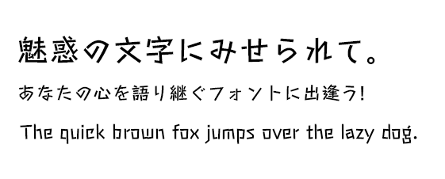

[English](https://github.com/fontworks-fonts/Stick) /[日本語](README-JP.md) 

## Stick-Regular

True to its name, Stick is designed with straight lines that create a cute and playful feel. The pastoral ambience also gives this font wide versatility for use in both paper mediums and digital content.  
[Learn more](https://fontworks.co.jp/fontsearch/stickstd-b/).

### Download the font

You can download pre-built the TrueType font from the following page.

[Latest release](https://github.com/fontworks-fonts/Stick/tree/master/fonts/ttf)

### Building the font from source

#### Requirements

* [python3](https://www.python.org/)  
* [fontmake](https://github.com/googlefonts/fontmake/)
* [fonttools](https://github.com/fonttools/fonttools/)
* [ttfautohint](https://www.freetype.org/ttfautohint/doc/ttfautohint.html)  

#### Build the font

Change the current working directory to 'Stick' folder and run **build.py** .

    $ python build.py

### Licence

This font is licensed under the [SIL Open Font License](https://scripts.sil.org/cms/scripts/page.php?site_id=nrsi&id=OFL).

### Characters

* All glyphs in [Adobe-Japan1-3](https://github.com/adobe-type-tools/Adobe-Japan1)
* [GF Latin Core](https://github.com/googlefonts/gftools/tree/master/Lib/gftools/encodings/GF%20Glyph%20Sets#gf-latin-core)  

### Prohibited acts

* Redistribute under license except 'SIL Open Font License Version 1.1'.
* Selling ​​the font file itself.
